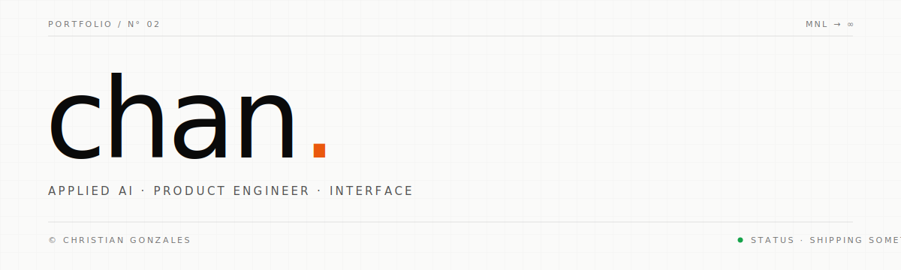

<picture>
  <source media="(prefers-color-scheme: dark)" srcset="./assets/header-dark.svg">
  
</picture>

&nbsp;

### now

applied ai engineer. shipping products end-to-end — interface, infrastructure, and the agents in between.

&nbsp;

### stack

```ts
const stack = {
  product:  ['typescript', 'react', 'next.js', 'tailwind', 'motion'],
  backend:  ['node', 'convex', 'supabase', 'postgres', 'redis'],
  ai:       ['claude', 'openai', 'vercel ai sdk'],
} as const
```

&nbsp;

### principles

```
01.  taste is a feature.
02.  ship the thing. polish the thing. ship again.
03.  design the flow, then write the components.
04.  good engineers make the unknown, known.
```

&nbsp;

---

<sub>[portfolio](https://www.gonzaleschan.com)&nbsp; · &nbsp;[mail](mailto:chrisgonzales.online@gmail.com)&nbsp; · &nbsp;[linkedin](https://www.linkedin.com/in/gonzaleschan)</sub>
